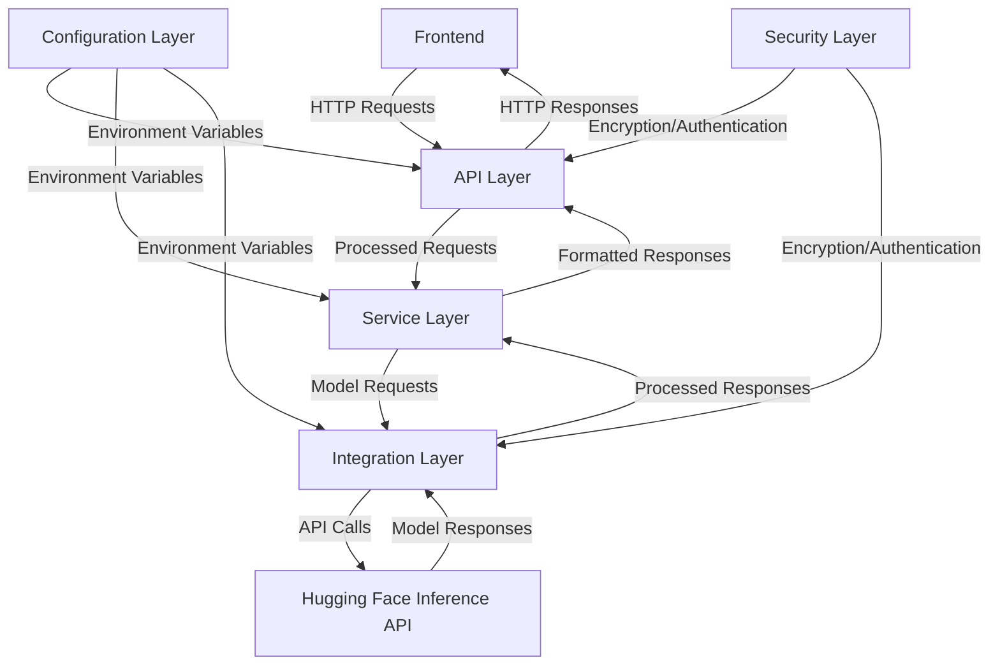

# Design Document: Hugging Face Backend Integration

## Overview

This design document outlines the architecture and implementation details for integrating the "DJanga24/keisha-qwen3-lora" Hugging Face model into our application's backend. The integration will enable users to interact with Keisha, an AI assistant fine-tuned to provide analysis on topics related to racism and white supremacy. The design focuses on secure API integration, environment variable management, encryption, and ensuring a reliable communication channel between the frontend and the Hugging Face inference API.

## Architecture

The backend integration will follow a layered architecture:

1. **API Layer**: Handles HTTP requests from the frontend and returns responses
2. **Service Layer**: Contains business logic for processing requests and responses
3. **Integration Layer**: Manages communication with the Hugging Face inference API
4. **Security Layer**: Implements encryption and authentication mechanisms
5. **Configuration Layer**: Manages environment variables and application settings



## Components and Interfaces

### 1. API Layer

#### Endpoints

- `POST /api/chat`: Accepts user messages and returns AI responses
- `GET /api/status`: Returns the status of the Hugging Face integration
- `GET /api/models`: Returns information about the available models

#### Request/Response Format

```javascript
// Chat Request
{
  "message": "User's message here",
  "conversationId": "unique-conversation-id",
  "context": [] // Optional previous messages for context
}

// Chat Response
{
  "response": "AI assistant's response",
  "conversationId": "unique-conversation-id",
  "timestamp": "ISO timestamp"
}
```

### 2. Service Layer

#### ChatService

- `processUserMessage(message, conversationId, context)`: Processes user messages and prepares them for the model
- `formatModelResponse(response)`: Formats the model's response for the frontend
- `manageConversationContext(conversationId, message, response)`: Manages conversation history and context

### 3. Integration Layer

#### HuggingFaceService

- `initialize()`: Sets up the connection to the Hugging Face inference API
- `sendRequest(prompt, options)`: Sends requests to the Hugging Face inference API
- `handleResponse(response)`: Processes responses from the Hugging Face API
- `handleError(error)`: Manages error handling for API communication

### 4. Security Layer

#### EncryptionService

- `encryptData(data)`: Encrypts sensitive data
- `decryptData(encryptedData)`: Decrypts encrypted data
- `generateEncryptionKeys()`: Generates encryption keys

#### AuthenticationService

- `authenticateRequest(request)`: Authenticates incoming requests
- `generateAuthToken(userId)`: Generates authentication tokens
- `validateAuthToken(token)`: Validates authentication tokens

### 5. Configuration Layer

#### ConfigService

- `loadEnvironmentVariables()`: Loads environment variables from .env files or deployment environment
- `getConfig(key, defaultValue)`: Retrieves configuration values with fallbacks
- `validateConfig()`: Validates that all required configuration is present

## Data Models

### Message

```javascript
{
  id: String,
  content: String,
  role: String, // "user" or "assistant"
  timestamp: Date,
  conversationId: String
}
```

### Conversation

```javascript
{
  id: String,
  messages: Array<Message>,
  createdAt: Date,
  updatedAt: Date,
  userId: String // Optional, for authenticated users
}
```

### ModelConfig

```javascript
{
  modelId: String, // "DJanga24/keisha-qwen3-lora"
  systemPrompt: String,
  temperature: Number,
  maxTokens: Number,
  topP: Number
}
```

## Error Handling

The system will implement comprehensive error handling:

1. **API Errors**: HTTP status codes with descriptive error messages
   - 400: Bad Request (invalid input)
   - 401: Unauthorized (authentication issues)
   - 403: Forbidden (authorization issues)
   - 404: Not Found (resource not available)
   - 429: Too Many Requests (rate limiting)
   - 500: Internal Server Error (server-side issues)
   - 503: Service Unavailable (Hugging Face API unavailable)

2. **Integration Errors**: Specific error types for Hugging Face API issues
   - Connection errors
   - Timeout errors
   - Rate limiting errors
   - Model-specific errors

3. **Error Response Format**:
```javascript
{
  "error": {
    "code": "ERROR_CODE",
    "message": "Human-readable error message",
    "details": {} // Optional additional error details
  }
}
```

## Testing Strategy

### Unit Testing

- Test individual components in isolation with mocked dependencies
- Focus on business logic in the Service Layer
- Ensure proper error handling in all components

### Integration Testing

- Test the interaction between components
- Verify proper communication with the Hugging Face API
- Test with both valid and invalid inputs

### End-to-End Testing

- Test the complete flow from frontend request to backend response
- Verify proper handling of conversation context
- Test error scenarios and recovery

### Performance Testing

- Measure response times under different loads
- Identify bottlenecks in the integration
- Establish baseline performance metrics

## Security Considerations

### API Key Management

- Store Hugging Face API keys in environment variables
- Implement key rotation mechanisms
- Use different keys for development and production

### Data Encryption

- Implement TLS for all API communications
- Consider end-to-end encryption for sensitive conversations
- Encrypt stored conversation data

### Authentication and Authorization

- Implement token-based authentication for API access
- Define role-based access control for different endpoints
- Rate limit requests to prevent abuse

## Deployment Considerations

### Environment Variables

Required environment variables:
- `HUGGINGFACE_API_KEY`: API key for Hugging Face
- `HUGGINGFACE_MODEL_ID`: Model identifier (DJanga24/keisha-qwen3-lora)
- `ENCRYPTION_KEY`: Key for encrypting sensitive data
- `NODE_ENV`: Environment (development, production)
- `API_PORT`: Port for the API server

### Scaling

- Implement caching for frequent requests
- Consider serverless deployment for automatic scaling
- Monitor resource usage and optimize as needed

### Monitoring

- Log API requests and responses (excluding sensitive data)
- Track error rates and response times
- Set up alerts for critical failures