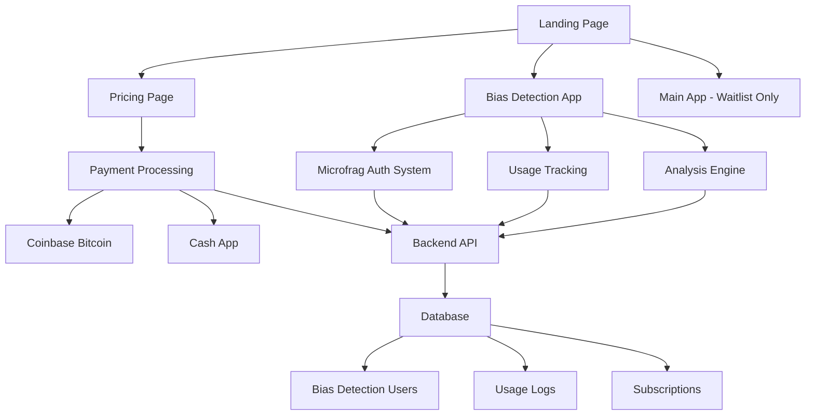

# Design Document

## Overview

The microfrag integration design creates a dual-service architecture where the existing Keisha AI main application remains in waitlist mode while the news bias detection micro-SaaS operates as a fully functional service with its own authentication, pricing, and usage tracking systems. The design leverages the existing React frontend structure and backend payment infrastructure while maintaining service separation.

## Architecture

### High-Level Architecture



### Service Separation Strategy

The design maintains clear separation between services:

- **Main App**: Remains unchanged, waitlist-only with admin login
- **Bias Detection Service**: Independent authentication, user management, and billing
- **Shared Components**: Landing page, pricing page, payment infrastructure

## Components and Interfaces

### Frontend Components

#### 1. Enhanced Landing Page (`LandingPage.js`)
- **Purpose**: Add navigation links for pricing and bias detection
- **New Elements**:
  - Navigation header with "Pricing" and "BS Article Bias-Detection" links
  - Updated hero section to mention both services
- **Integration**: Maintains existing design system and styling

#### 2. Unified Pricing Page (`PricingPage.js`)
- **Purpose**: Display pricing for both services with clear separation
- **Structure**:
  ```jsx
  <div className="pricing-container">
    <section className="keisha-ai-pricing">
      <h2>Keisha AI (Main)</h2>
      <div className="waitlist-cta">Join the Waitlist</div>
    </section>
    
    <section className="keisha-news-pricing">
      <h2>Keisha News (Micro)</h2>
      <div className="pricing-tiers">
        <div className="tier-free">3 uses/day</div>
        <div className="tier-monthly">
          <div className="bitcoin-price">$10/month (Bitcoin)</div>
          <div className="cashapp-price">$20/month (Cash App)</div>
          <div className="usage">10 uses/day</div>
        </div>
        <div className="tier-annual">
          <div className="bitcoin-price">$100/year (Bitcoin)</div>
          <div className="cashapp-price">$150/year (Cash App)</div>
          <div className="usage">Unlimited</div>
        </div>
      </div>
    </section>
  </div>
  ```

#### 3. Integrated Microfrag App (`MicrofragApp.js`)
- **Purpose**: Wrap existing microfrag components with authentication and usage tracking
- **Key Features**:
  - Authentication modal for new users
  - Usage counter display
  - Paywall modal when limits exceeded
  - Integration with existing analysis components

#### 4. Bias Detection Authentication (`BiasAuthModal.js`)
- **Purpose**: Handle user registration/login for bias detection service
- **Features**:
  - Email/password authentication
  - Guest mode with IP-based tracking
  - Integration with backend user management

#### 5. Usage Tracking Component (`UsageTracker.js`)
- **Purpose**: Monitor and display user usage limits
- **Functionality**:
  - Real-time usage counter
  - Daily limit enforcement
  - Subscription tier display

### Backend API Endpoints

#### Authentication Endpoints
```
POST /api/bias-auth/register
POST /api/bias-auth/login
POST /api/bias-auth/logout
GET /api/bias-auth/profile
```

#### Usage Tracking Endpoints
```
GET /api/bias-usage/current
POST /api/bias-usage/increment
GET /api/bias-usage/limits
```

#### Analysis Endpoints
```
POST /api/bias-analysis/analyze
GET /api/bias-analysis/history
```

#### Payment Endpoints (Extended)
```
POST /api/bias-payment/create-subscription
POST /api/bias-payment/cancel-subscription
GET /api/bias-payment/status
```

## Data Models

### Bias Detection User Profile
```typescript
interface BiasUser {
  id: string;
  email: string;
  password_hash: string;
  subscription_tier: 'free' | 'monthly' | 'annual';
  subscription_expires_at: Date | null;
  daily_usage_count: number;
  last_usage_reset: Date;
  payment_method: 'bitcoin' | 'cashapp' | null;
  created_at: Date;
  updated_at: Date;
}
```

### Usage Log
```typescript
interface UsageLog {
  id: string;
  user_id: string | null; // null for anonymous users
  ip_address: string;
  analysis_type: 'bias_detection';
  timestamp: Date;
  article_length: number;
  analysis_result: AnalysisResult;
}
```

### Subscription Record
```typescript
interface BiasSubscription {
  id: string;
  user_id: string;
  tier: 'monthly' | 'annual';
  payment_method: 'bitcoin' | 'cashapp';
  amount_paid: number;
  currency: string;
  payment_id: string; // Coinbase or Cash App transaction ID
  starts_at: Date;
  expires_at: Date;
  status: 'active' | 'expired' | 'cancelled';
  created_at: Date;
}
```

## Error Handling

### Frontend Error Handling
- **Network Errors**: Display user-friendly messages with retry options
- **Authentication Errors**: Clear error messages with login prompts
- **Usage Limit Errors**: Paywall modal with upgrade options
- **Payment Errors**: Detailed error messages with alternative payment methods

### Backend Error Handling
- **Rate Limiting**: Implement per-IP and per-user rate limiting
- **Authentication Failures**: Secure error responses without information leakage
- **Payment Processing Errors**: Comprehensive error logging and user notification
- **Database Errors**: Graceful degradation with fallback responses

## Testing Strategy

### Unit Testing
- **Component Testing**: Test all new React components with Jest and React Testing Library
- **API Testing**: Test all new backend endpoints with comprehensive test cases
- **Authentication Testing**: Test login/logout flows and session management
- **Payment Testing**: Mock payment processing with test scenarios

### Integration Testing
- **End-to-End Testing**: Test complete user journeys from landing page to analysis
- **Payment Integration**: Test payment flows with Coinbase and Cash App sandbox environments
- **Usage Tracking**: Test daily limits and subscription tier enforcement
- **Cross-Browser Testing**: Ensure compatibility across major browsers

### Performance Testing
- **Load Testing**: Test API endpoints under expected user loads
- **Database Performance**: Optimize queries for usage tracking and user management
- **Frontend Performance**: Ensure fast loading times for bias detection interface

## Security Considerations

### Authentication Security
- **Password Hashing**: Use bcrypt with appropriate salt rounds
- **Session Management**: Implement secure JWT tokens with appropriate expiration
- **Rate Limiting**: Prevent brute force attacks on authentication endpoints

### Data Protection
- **User Privacy**: Implement data retention policies for analysis logs
- **PCI Compliance**: Ensure payment processing meets security standards
- **API Security**: Implement proper authorization checks for all endpoints

### Usage Tracking Security
- **IP-based Tracking**: Implement privacy-respecting IP hashing for anonymous users
- **Data Minimization**: Store only necessary data for usage tracking
- **Audit Logging**: Maintain comprehensive logs for security monitoring

## Deployment Strategy

### Frontend Deployment
- **Build Process**: Extend existing build process to include new components
- **Environment Configuration**: Add environment variables for bias detection service
- **Asset Management**: Ensure proper bundling of new components and styles

### Backend Deployment
- **Database Migration**: Create new tables for bias detection users and usage tracking
- **API Versioning**: Implement versioned endpoints for backward compatibility
- **Configuration Management**: Add configuration for new service features

### Monitoring and Analytics
- **Usage Analytics**: Track user engagement and conversion metrics
- **Performance Monitoring**: Monitor API response times and error rates
- **Business Metrics**: Track subscription conversions and revenue