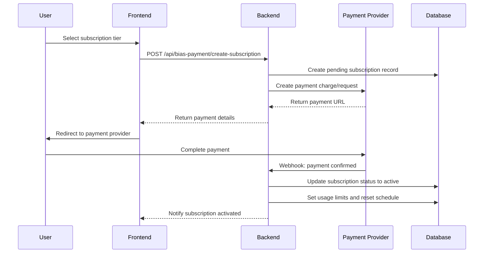

# Payment Integration Specification for Bias Detection Service

## Overview

This document specifies the payment integration requirements for the Keisha News bias detection micro-SaaS service. The payment system extends the existing Coinbase (Bitcoin) and Cash App infrastructure to support subscription-based billing with differentiated pricing tiers and usage limits.

## Pricing Structure

### Service Tiers

| Tier | Bitcoin Price | Cash App Price | Usage Limit | Billing Cycle |
|------|---------------|----------------|-------------|---------------|
| Free | $0 | $0 | 3 analyses/day | N/A |
| Monthly | $10/month | $20/month | 10 analyses/day | 30 days |
| Annual | $100/year | $150/year | Unlimited | 365 days |

### Pricing Strategy
- **Bitcoin Incentive**: 50% discount for Bitcoin payments to encourage cryptocurrency adoption
- **Annual Discount**: Significant savings for annual subscriptions (17% for Bitcoin, 38% for Cash App)
- **Freemium Model**: Free tier with limited usage to drive conversion

## Payment Endpoints

### Subscription Creation
```
POST /api/bias-payment/create-subscription
```

**Request Body:**
```json
{
  "user_id": "string",
  "tier": "monthly" | "annual",
  "payment_method": "bitcoin" | "cashapp",
  "return_url": "string",
  "cancel_url": "string"
}
```

**Response:**
```json
{
  "subscription_id": "string",
  "payment_url": "string",
  "amount": number,
  "currency": "USD" | "BTC",
  "expires_at": "ISO8601 timestamp"
}
```

### Payment Confirmation
```
POST /api/bias-payment/confirm-payment
```

**Request Body:**
```json
{
  "subscription_id": "string",
  "payment_id": "string",
  "payment_method": "bitcoin" | "cashapp",
  "transaction_hash": "string" // For Bitcoin
}
```

### Subscription Status
```
GET /api/bias-payment/subscription/{user_id}
```

**Response:**
```json
{
  "subscription_id": "string",
  "user_id": "string",
  "tier": "free" | "monthly" | "annual",
  "status": "active" | "expired" | "cancelled" | "pending",
  "payment_method": "bitcoin" | "cashapp" | null,
  "current_period_start": "ISO8601 timestamp",
  "current_period_end": "ISO8601 timestamp",
  "auto_renew": boolean,
  "usage_limit": number,
  "usage_reset_frequency": "daily" | "unlimited"
}
```

### Subscription Cancellation
```
POST /api/bias-payment/cancel-subscription
```

**Request Body:**
```json
{
  "user_id": "string",
  "subscription_id": "string",
  "reason": "string" // Optional
}
```

## Payment Provider Integration

### Coinbase Commerce (Bitcoin)

#### Configuration
```javascript
const coinbaseConfig = {
  apiKey: process.env.COINBASE_API_KEY,
  webhookSecret: process.env.COINBASE_WEBHOOK_SECRET,
  environment: process.env.NODE_ENV === 'production' ? 'live' : 'sandbox'
};
```

#### Charge Creation
```javascript
const createBitcoinCharge = async (subscriptionData) => {
  const charge = {
    name: `Keisha News ${subscriptionData.tier} Subscription`,
    description: `Bias detection service - ${subscriptionData.tier} tier`,
    pricing_type: 'fixed_price',
    local_price: {
      amount: subscriptionData.tier === 'monthly' ? '10.00' : '100.00',
      currency: 'USD'
    },
    metadata: {
      user_id: subscriptionData.user_id,
      subscription_id: subscriptionData.subscription_id,
      tier: subscriptionData.tier,
      service: 'bias_detection'
    },
    redirect_url: subscriptionData.return_url,
    cancel_url: subscriptionData.cancel_url
  };
  
  return await coinbaseClient.charge.create(charge);
};
```

#### Webhook Handling
```javascript
const handleCoinbaseWebhook = (event) => {
  switch (event.type) {
    case 'charge:confirmed':
      return activateSubscription(event.data.metadata);
    case 'charge:failed':
      return handlePaymentFailure(event.data.metadata);
    case 'charge:delayed':
      return handleDelayedPayment(event.data.metadata);
    default:
      console.log(`Unhandled Coinbase event: ${event.type}`);
  }
};
```

### Cash App Integration

#### Configuration
```javascript
const cashAppConfig = {
  applicationId: process.env.CASHAPP_APPLICATION_ID,
  accessToken: process.env.CASHAPP_ACCESS_TOKEN,
  environment: process.env.NODE_ENV === 'production' ? 'production' : 'sandbox',
  webhookSignatureKey: process.env.CASHAPP_WEBHOOK_SIGNATURE_KEY
};
```

#### Payment Request Creation
```javascript
const createCashAppPayment = async (subscriptionData) => {
  const payment = {
    amount_money: {
      amount: subscriptionData.tier === 'monthly' ? 2000 : 15000, // In cents
      currency: 'USD'
    },
    source_id: 'CASH_APP_PAY',
    idempotency_key: subscriptionData.subscription_id,
    app_fee_money: {
      amount: Math.floor((subscriptionData.tier === 'monthly' ? 2000 : 15000) * 0.029), // 2.9% fee
      currency: 'USD'
    },
    note: `Keisha News ${subscriptionData.tier} subscription`,
    order_id: subscriptionData.subscription_id
  };
  
  return await cashAppClient.paymentsApi.createPayment(payment);
};
```

## Subscription Management Logic

### Activation Flow


### Renewal Logic

#### Automatic Renewal Check
```javascript
const checkSubscriptionRenewals = async () => {
  const expiringSubscriptions = await db.query(`
    SELECT * FROM bias_subscriptions 
    WHERE expires_at <= NOW() + INTERVAL '24 hours'
    AND status = 'active'
    AND auto_renew = true
  `);
  
  for (const subscription of expiringSubscriptions) {
    await processRenewal(subscription);
  }
};
```

#### Renewal Processing
```javascript
const processRenewal = async (subscription) => {
  try {
    // Create new payment charge
    const paymentResult = await createRenewalPayment(subscription);
    
    // Update subscription with new period
    await db.query(`
      UPDATE bias_subscriptions 
      SET 
        current_period_start = expires_at,
        current_period_end = expires_at + INTERVAL '${subscription.tier === 'monthly' ? '1 month' : '1 year'}',
        payment_id = $1,
        updated_at = NOW()
      WHERE id = $2
    `, [paymentResult.id, subscription.id]);
    
    // Send renewal notification
    await sendRenewalNotification(subscription.user_id);
    
  } catch (error) {
    // Handle renewal failure
    await handleRenewalFailure(subscription, error);
  }
};
```

### Expiration Handling
```javascript
const handleSubscriptionExpiration = async (subscriptionId) => {
  // Update subscription status
  await db.query(`
    UPDATE bias_subscriptions 
    SET status = 'expired', updated_at = NOW()
    WHERE id = $1
  `, [subscriptionId]);
  
  // Reset user to free tier
  await db.query(`
    UPDATE bias_users 
    SET 
      subscription_tier = 'free',
      daily_usage_limit = 3,
      updated_at = NOW()
    WHERE id = (
      SELECT user_id FROM bias_subscriptions WHERE id = $1
    )
  `, [subscriptionId]);
  
  // Send expiration notification
  const user = await getUserBySubscriptionId(subscriptionId);
  await sendExpirationNotification(user.email);
};
```

## Usage Limit Enforcement

### Daily Usage Reset
```javascript
const resetDailyUsage = async () => {
  const now = new Date();
  const resetTime = new Date(now.getFullYear(), now.getMonth(), now.getDate(), 0, 0, 0);
  
  await db.query(`
    UPDATE bias_users 
    SET 
      daily_usage_count = 0,
      last_usage_reset = $1
    WHERE last_usage_reset < $1
  `, [resetTime]);
};
```

### Usage Limit Check
```javascript
const checkUsageLimit = async (userId, ipAddress) => {
  let user;
  
  if (userId) {
    // Authenticated user
    user = await db.query(`
      SELECT subscription_tier, daily_usage_count, daily_usage_limit
      FROM bias_users 
      WHERE id = $1
    `, [userId]);
  } else {
    // Anonymous user - check by IP
    const today = new Date().toISOString().split('T')[0];
    const ipUsage = await db.query(`
      SELECT COUNT(*) as usage_count
      FROM usage_logs 
      WHERE ip_address = $1 
      AND DATE(timestamp) = $2
      AND user_id IS NULL
    `, [ipAddress, today]);
    
    return {
      canUse: ipUsage.rows[0].usage_count < 3,
      remainingUses: Math.max(0, 3 - ipUsage.rows[0].usage_count),
      tier: 'free'
    };
  }
  
  const canUse = user.daily_usage_count < user.daily_usage_limit;
  const remainingUses = Math.max(0, user.daily_usage_limit - user.daily_usage_count);
  
  return {
    canUse,
    remainingUses,
    tier: user.subscription_tier
  };
};
```

## Error Handling

### Payment Failures
```javascript
const handlePaymentFailure = async (metadata) => {
  const { user_id, subscription_id, tier } = metadata;
  
  // Update subscription status
  await db.query(`
    UPDATE bias_subscriptions 
    SET status = 'failed', updated_at = NOW()
    WHERE id = $1
  `, [subscription_id]);
  
  // Send failure notification with retry options
  await sendPaymentFailureNotification(user_id, {
    tier,
    retryUrl: `/pricing?retry=${subscription_id}`,
    supportEmail: 'support@keishaai.com'
  });
  
  // Log failure for analytics
  await logPaymentEvent('payment_failed', {
    user_id,
    subscription_id,
    tier,
    timestamp: new Date()
  });
};
```

### Subscription Conflicts
```javascript
const handleSubscriptionConflict = async (userId, newTier) => {
  // Check for existing active subscription
  const existingSubscription = await db.query(`
    SELECT * FROM bias_subscriptions 
    WHERE user_id = $1 AND status = 'active'
  `, [userId]);
  
  if (existingSubscription.rows.length > 0) {
    const existing = existingSubscription.rows[0];
    
    if (existing.tier === newTier) {
      throw new Error('User already has an active subscription for this tier');
    }
    
    // Handle upgrade/downgrade
    return await processSubscriptionChange(existing, newTier);
  }
};
```

## Webhook Security

### Signature Verification
```javascript
const verifyWebhookSignature = (payload, signature, secret) => {
  const crypto = require('crypto');
  const expectedSignature = crypto
    .createHmac('sha256', secret)
    .update(payload)
    .digest('hex');
  
  return crypto.timingSafeEqual(
    Buffer.from(signature, 'hex'),
    Buffer.from(expectedSignature, 'hex')
  );
};
```

### Webhook Endpoints
```javascript
// Coinbase webhook
app.post('/webhooks/coinbase', (req, res) => {
  const signature = req.headers['x-cc-webhook-signature'];
  
  if (!verifyWebhookSignature(req.body, signature, process.env.COINBASE_WEBHOOK_SECRET)) {
    return res.status(401).send('Unauthorized');
  }
  
  handleCoinbaseWebhook(req.body);
  res.status(200).send('OK');
});

// Cash App webhook
app.post('/webhooks/cashapp', (req, res) => {
  const signature = req.headers['square-signature'];
  
  if (!verifyWebhookSignature(req.body, signature, process.env.CASHAPP_WEBHOOK_SIGNATURE_KEY)) {
    return res.status(401).send('Unauthorized');
  }
  
  handleCashAppWebhook(req.body);
  res.status(200).send('OK');
});
```

## Analytics and Reporting

### Payment Metrics
```javascript
const getPaymentMetrics = async (startDate, endDate) => {
  return await db.query(`
    SELECT 
      payment_method,
      tier,
      COUNT(*) as subscription_count,
      SUM(amount_paid) as total_revenue,
      AVG(amount_paid) as average_revenue
    FROM bias_subscriptions 
    WHERE created_at BETWEEN $1 AND $2
    AND status = 'active'
    GROUP BY payment_method, tier
    ORDER BY total_revenue DESC
  `, [startDate, endDate]);
};
```

### Conversion Tracking
```javascript
const trackConversion = async (userId, fromTier, toTier, paymentMethod) => {
  await db.query(`
    INSERT INTO conversion_events (
      user_id, from_tier, to_tier, payment_method, timestamp
    ) VALUES ($1, $2, $3, $4, NOW())
  `, [userId, fromTier, toTier, paymentMethod]);
};
```

## Testing Requirements

### Payment Testing
- **Sandbox Environment**: Use Coinbase Commerce sandbox and Cash App sandbox for testing
- **Test Scenarios**: 
  - Successful payments for all tiers and payment methods
  - Failed payments and retry logic
  - Webhook delivery and processing
  - Subscription renewals and expirations
  - Usage limit enforcement

### Integration Testing
```javascript
describe('Payment Integration', () => {
  test('should create Bitcoin subscription successfully', async () => {
    const subscriptionData = {
      user_id: 'test-user-123',
      tier: 'monthly',
      payment_method: 'bitcoin'
    };
    
    const result = await createSubscription(subscriptionData);
    expect(result.payment_url).toBeDefined();
    expect(result.amount).toBe(10);
  });
  
  test('should enforce usage limits correctly', async () => {
    const userId = 'test-user-123';
    
    // Simulate 3 uses for free user
    for (let i = 0; i < 3; i++) {
      await incrementUsage(userId);
    }
    
    const usageCheck = await checkUsageLimit(userId);
    expect(usageCheck.canUse).toBe(false);
    expect(usageCheck.remainingUses).toBe(0);
  });
});
```

## Security Considerations

### PCI Compliance
- **No Card Data Storage**: All payment processing handled by certified providers
- **Secure Transmission**: HTTPS for all payment-related communications
- **Token-based Authentication**: Use secure tokens for payment confirmations

### Fraud Prevention
- **Rate Limiting**: Limit subscription creation attempts per IP/user
- **Duplicate Detection**: Prevent duplicate subscriptions for same user/tier
- **Suspicious Activity Monitoring**: Alert on unusual payment patterns

### Data Protection
- **Payment Data Minimization**: Store only necessary payment metadata
- **Encryption**: Encrypt sensitive payment-related data at rest
- **Access Controls**: Restrict payment data access to authorized personnel only

## Deployment Configuration

### Environment Variables
```bash
# Coinbase Configuration
COINBASE_API_KEY=your_coinbase_api_key
COINBASE_WEBHOOK_SECRET=your_webhook_secret

# Cash App Configuration
CASHAPP_APPLICATION_ID=your_cashapp_app_id
CASHAPP_ACCESS_TOKEN=your_cashapp_access_token
CASHAPP_WEBHOOK_SIGNATURE_KEY=your_webhook_signature_key

# Payment Configuration
PAYMENT_SUCCESS_URL=https://yourdomain.com/payment/success
PAYMENT_CANCEL_URL=https://yourdomain.com/payment/cancel
```

### Database Indexes
```sql
-- Optimize subscription queries
CREATE INDEX idx_bias_subscriptions_user_status ON bias_subscriptions(user_id, status);
CREATE INDEX idx_bias_subscriptions_expires_at ON bias_subscriptions(expires_at) WHERE status = 'active';

-- Optimize usage tracking queries
CREATE INDEX idx_usage_logs_user_date ON usage_logs(user_id, DATE(timestamp));
CREATE INDEX idx_usage_logs_ip_date ON usage_logs(ip_address, DATE(timestamp)) WHERE user_id IS NULL;
```

This payment integration specification provides a comprehensive framework for implementing subscription-based billing for the bias detection service while leveraging existing payment infrastructure and maintaining security best practices.